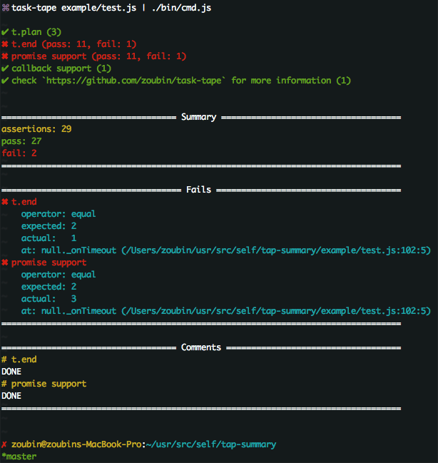

# tap-summary
Summarize TAP.

## Usage

```javascript
var reporter = require('tap-summary')()

```

or in `package.json`

```json
{
  "scripts": {
    "test": "tape test/*.js | tap-summary"
  }
}
```

## Example



