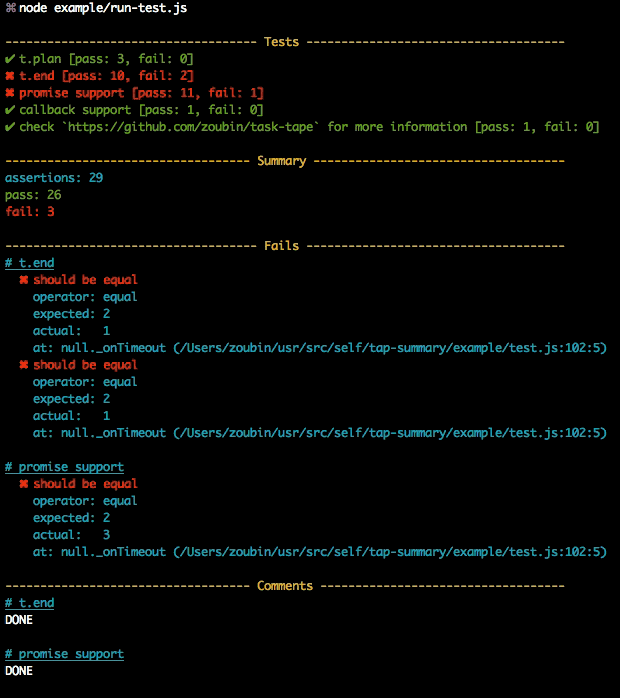

# tap-summary
[](https://www.npmjs.org/package/tap-summary)
[](https://travis-ci.org/zoubin/tap-summary)
[](https://david-dm.org/zoubin/tap-summary)
[](https://david-dm.org/zoubin/tap-summary#info=devDependencies)

A reporter for TAP.

## Example



## Usage

### package.json
```json
{
  "scripts": {
    "test": "tape test/*.js | tap-summary"
  }
}
```

### CLI Options

```
  --no-ansi        Disable ANSI formatting
  --no-progress    Disable progress output during tests
```

### API

```js
var summarize = require('tap-summary')

var fs = require('fs')
fs.createReadStream('test.tap')
  .pipe(summarize({
    ansi: true,
    progress: true,
  }))
  .pipe(process.stdout)

```

Also, the default formatter could be replaced with custom ones.

```js
var reporter = require('tap-summary').reporter()

var fs = require('fs')
fs.createReadStream('test.tap')
  .pipe(customize(reporter))
  .pipe(process.stdout)

```

The `reporter` is a `Duplex`,
which consumes the TAP input and output nothing by default.
However, it emits the following events during the process,
so that `customize` could listen to them and add something into the output.

* reporter.on('test.start', test => {}).
  Fired when a new test detected.
* reporter.on('test.end', test => {}).
  Fired when the end of a test reached.
* reporter.on('test.assert', (assertion, test) => {}).
  Fired when a new assertion found.
* reporter.on('summary', (stats, fails, comments) => {}). 
  Fired when all TAP input has been processed.

Details about the `test` and `assertion` object could be found [here][tap-out].

The `stats` object:
```js
var stats = {
  // the total time (ms) it takes
  duration: duration,
  // the total number of assertions planned
  planned: res.plans.reduce(function (p, c) {
    return c.to - c.from + 1 + p;
  }, 0),
  // the actual total number of assertions found
  assertions: res.asserts.length,
  // the number of successful assertions
  pass: res.pass.length,
  // the number of failed assertions
  fail: res.fail.length,
  // the number of comments found
  comments: res.comments.length,
}

```

`fails` will be `null` unless `stats.fail > 0`:
```js
{ 
  testName: [failedAssertion]
}

```

`comments` will be `null` unless `stats.comments > 0`:
```js
{ 
  testName: [comment]
}

```

[tap-out]: https://github.com/scottcorgan/tap-out
